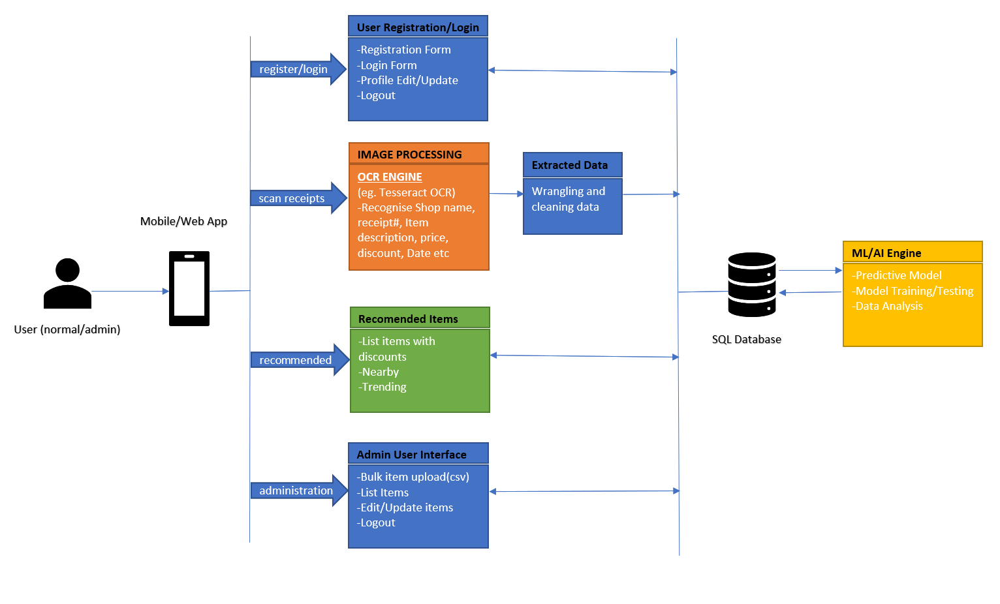
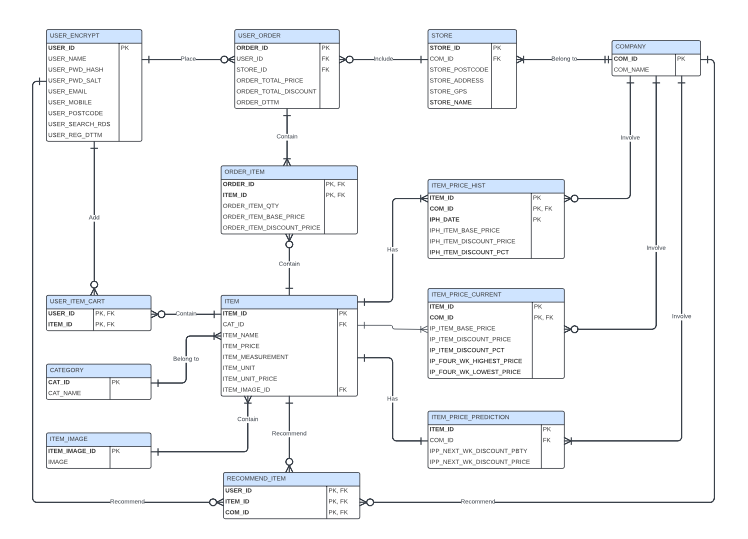
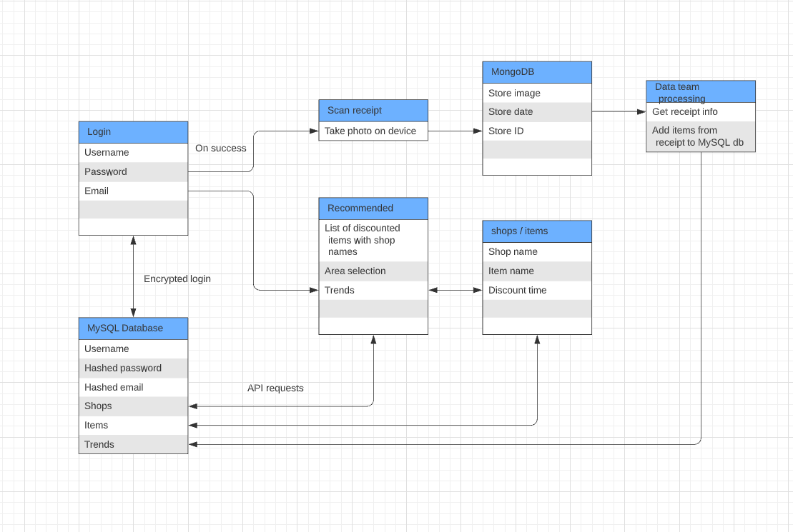

# Machine Learning Grocery Item Recommender App
This is a project to develop a grocery item recommendation app making use of machine learning technology.

<!-- PROJECT SHIELDS -->
[![MIT License][license-shield]][license-url]
[![LinkedIn][linkedin-shield]][linkedin-url]

<!-- PROJECT Image -->
 

  

<!-- ABOUT THE PROJECT -->
## About The Project

Machine learning can be utilized in various ways to enhance the grocery shopping experience for both retailers and customers. For example, retailers can use machine learning algorithms to analyze customer purchase history, preferences, and browsing behavior to provide personalized product recommendations. This can improve customer satisfaction, increase sales, and encourage repeat purchases. Machine learning can also be used for predictive analytics to forecast sales, identify emerging trends, and anticipate customer needs. By leveraging historical data and machine learning models, retailers can make data-driven decisions and adapt their strategies accordingly.

In this project we will implement an mobile application which ingest latest item price data and customer purchase history, then analysis and produce grocery item recommendation using machine learning collaborative filtering technique. The app is implement in Google Cloud Platform to increase its scalabilitgy and flexibility but the source code is also able to run in local host environment with minimum modification.

### Built With

* Python 3.6
* Keras 2.12
* [MySql](https://www.mysql.com/)
* [Express framework](https://expressjs.com/)
* [React Native](https://reactnative.dev/)
* [Node.js](https://nodejs.org/)

(<a href="#readme-top">back to top</a>)

<!-- GETTING STARTED -->
## Getting Started

1. Clone the git repository
2. Install the backend application environment according to [System Specification](3_design/DCM-System-Specification-v2.0.pdf)
3. Setup database environment and data processing job according to [Database Setup Folder](4_development/database) 
4. Ingest data source files
5. Execute [Item Recommendation Python Script](4_development/item-recommender/collaborative_filtering/etl_gen_recommend_item.py)

### Prerequisites

* Knowledge of python
* Knowledge of database query
* Knowledge of express framework
* Knowledge of React Native
* Knowledge of node.js

### Data Sources

Source data of the data platform are as below:
1. Weekly item price. From web scrapping tool weekly exported CSV datafile.
2. Customer purchase transactions. From user scanned receipt and Woolworths provided test
transaction data file.
3. Item images. Download from Internet.

In order to load data into the database, you will need to collect the item price, item image file and customer purchase transaction following the guide in [System Specification](3_design/DCM-System-Specification-v2.0.pdf).

(<a href="#readme-top">back to top</a>)

## Design Overview

### Architecture Design

  

### Database Design

  

### Backend Dataflow Design

  

(<a href="#readme-top">back to top</a>)

<!-- LICENSE -->
## License

Distributed under the MIT License. See `LICENSE.txt` for more information.

(<a href="#readme-top">back to top</a>)

<!-- CONTACT -->
## Contact

Oscar Lee 
Email: mail.oscar.lee@gmail.com 
LinkedIn: [https://www.linkedin.com/in/oscarlee1](https://www.linkedin.com/in/oscarlee1) 

(<a href="#readme-top">back to top</a>)

<!-- MARKDOWN LINKS & IMAGES -->
[license-shield]: https://img.shields.io/github/license/othneildrew/Best-README-Template.svg?style=for-the-badge
[license-url]: LICENSE
[linkedin-shield]: https://img.shields.io/badge/-LinkedIn-black.svg?style=for-the-badge&logo=linkedin&colorB=555
[linkedin-url]: https://www.linkedin.com/in/oscarlee1
[Next.js]: https://img.shields.io/badge/next.js-000000?style=for-the-badge&logo=nextdotjs&logoColor=white
[Next-url]: https://nextjs.org/
[React.js]: https://img.shields.io/badge/React-20232A?style=for-the-badge&logo=react&logoColor=61DAFB
[React-url]: https://reactjs.org/
[Vue.js]: https://img.shields.io/badge/Vue.js-35495E?style=for-the-badge&logo=vuedotjs&logoColor=4FC08D
[Vue-url]: https://vuejs.org/
[Angular.io]: https://img.shields.io/badge/Angular-DD0031?style=for-the-badge&logo=angular&logoColor=white
[Angular-url]: https://angular.io/
[Svelte.dev]: https://img.shields.io/badge/Svelte-4A4A55?style=for-the-badge&logo=svelte&logoColor=FF3E00
[Svelte-url]: https://svelte.dev/
[Laravel.com]: https://img.shields.io/badge/Laravel-FF2D20?style=for-the-badge&logo=laravel&logoColor=white
[Laravel-url]: https://laravel.com
[Bootstrap.com]: https://img.shields.io/badge/Bootstrap-563D7C?style=for-the-badge&logo=bootstrap&logoColor=white
[Bootstrap-url]: https://getbootstrap.com
[JQuery.com]: https://img.shields.io/badge/jQuery-0769AD?style=for-the-badge&logo=jquery&logoColor=white
[JQuery-url]: https://jquery.com 
